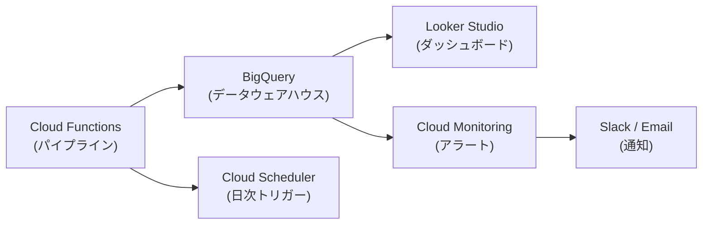

# 経営ダッシュボード設計書

## 1. 目的

CRMパイプラインの運用KPIを経営層・マーケティング部門が一目で把握できるダッシュボードを設計する。
「Notebookを開かなくても、施策の効果がわかる」状態を目指す。

---

## 2. ダッシュボード構成

### 2-1. 推奨ツール
| 候補 | 選定理由 | 備考 |
|------|---------|------|
| **Looker Studio (旧 Data Studio)** | GCP/BigQuery とネイティブ連携、無料 | 推奨 |
| Streamlit | Python で柔軟にカスタマイズ可能 | プロトタイプ用 |
| Metabase | OSS、セルフホスト可能 | 中規模チーム向け |

### 2-2. データソース
```
BigQuery
├── crm_analytics.customers_scored       ← 日次更新（スコアリング結果）
├── crm_analytics.segment_transitions    ← 日次更新（セグメント遷移）
├── crm_analytics.campaign_results       ← 施策後に更新（A/Bテスト結果）
├── crm_analytics.model_performance      ← 週次更新（モデル精度）
├── crm_analytics.data_quality_reports   ← 日次更新（品質チェック結果）
└── crm_analytics.roi_tracking           ← 月次更新（ROI実績 vs 予測）
```

---

## 3. ダッシュボードページ構成

### Page 1: 📊 エグゼクティブサマリー

**対象**: 経営層、事業責任者
**更新頻度**: 日次
**目的**: 3秒で「今月の状態」がわかる

```
┌─────────────────────────────────────────────────────────┐
│  📊 CRM エグゼクティブダッシュボード    [2026年8月]       │
├──────────┬──────────┬──────────┬──────────┬──────────────┤
│ 顧客数   │ 月間売上 │ 離脱率   │ 施策ROI  │ モデル精度   │
│ 10,000   │ ¥45.2M  │ 12.3%   │ 185%     │ AUC 0.87    │
│ +2.1%    │ +8.5%   │ -1.2pt  │ ↑23pt   │ (安定)      │
├──────────┴──────────┴──────────┴──────────┴──────────────┤
│ [セグメント別売上構成 円グラフ]  [月次トレンド 折れ線]     │
├─────────────────────────────────────────────────────────┤
│ ⚠️ アラート: Seg3_離反顧客が先月比+15%増加              │
└─────────────────────────────────────────────────────────┘
```

#### 指標定義

| KPI | 定義 | データソース | アラート条件 |
|-----|------|-------------|-------------|
| 顧客数 | アクティブ顧客数（90日以内に行動あり） | customers_scored | 前月比 -5% |
| 月間売上 | 当月の購入合計金額 | customers_scored | 前年同月比 -10% |
| 離脱率 | churn_probability ≥ 0.6 の顧客割合 | customers_scored | 前月比 +2pt |
| 施策ROI | (回収売上 - 施策コスト) / 施策コスト × 100 | campaign_results | ROI < 100% |
| モデル精度 | 離脱予測モデルの直近AUC | model_performance | AUC < 0.80 |

---

### Page 2: 🎯 セグメント詳細

**対象**: CRMマーケター
**更新頻度**: 日次

```
┌─────────────────────────────────────────────────────────┐
│  🎯 セグメント分析                                       │
├─────────────────────────────────────────────────────────┤
│ [9セグメント構成比 ツリーマップ]                          │
│                                                         │
│ セグメント選択: [Seg3_離反顧客 ▼]                        │
│ ┌───────────────────┬───────────────────────────┐      │
│ │ 人数: 1,200       │ 平均LTV: ¥45,000         │      │
│ │ 先月比: +180      │ 離脱確率: 0.72           │      │
│ │ 流入Ch: SNS 45%   │ 主要カテゴリ: コスメ     │      │
│ └───────────────────┴───────────────────────────┘      │
│                                                         │
│ [セグメント遷移サンキー図（Plotly）]                      │
│                                                         │
│ ⚠️ 先月ロイヤル → 今月離反: 45人（要介入）              │
└─────────────────────────────────────────────────────────┘
```

---

### Page 3: 💰 施策効果測定

**対象**: CRMマーケター、事業責任者
**更新頻度**: 施策後 7/14/30 日

```
┌─────────────────────────────────────────────────────────┐
│  💰 施策効果レポート                                     │
├─────────────────────────────────────────────────────────┤
│ キャンペーン選択: [2026-08 カムバック施策 ▼]             │
│                                                         │
│ A/Bテスト結果:                                          │
│ ┌──────────┬──────────┬──────────┬──────────┐          │
│ │          │ Treatment│ Control  │ Uplift   │          │
│ │ CVR      │ 18.5%    │ 12.3%   │ +6.2pt ✅│          │
│ │ 平均単価 │ ¥8,200   │ ¥7,100  │ +¥1,100  │          │
│ │ ROI      │ 185%     │ —       │ —        │          │
│ └──────────┴──────────┴──────────┴──────────┘          │
│ p値: 0.003 (有意) / 検出力: 0.91                        │
│                                                         │
│ [想定ROI vs 実績ROI 比較 棒グラフ]                       │
│                                                         │
│ 📌 フィードバック: uplift係数を 0.8 → 0.72 に更新推奨   │
└─────────────────────────────────────────────────────────┘
```

---

### Page 4: 🔧 システム健全性

**対象**: MLOpsエンジニア、データサイエンティスト
**更新頻度**: 日次

```
┌─────────────────────────────────────────────────────────┐
│  🔧 システム健全性モニター                               │
├─────────────────────────────────────────────────────────┤
│ データ品質スコア: 98.5% ✅                               │
│ [品質チェック項目一覧テーブル]                            │
│                                                         │
│ モデルドリフト:                                          │
│ [特徴量別PSI値 棒グラフ] (全て < 0.10 → 安定)           │
│                                                         │
│ モデルバージョン:                                        │
│ ┌──────────┬──────────┬──────────┬──────────┐          │
│ │ モデル   │ Version  │ AUC/R²  │ 最終学習  │          │
│ │ Churn    │ v3       │ 0.87    │ 2026-08-01│          │
│ │ LTV      │ v2       │ 0.72    │ 2026-07-15│          │
│ └──────────┴──────────┴──────────┴──────────┘          │
│                                                         │
│ パイプライン実行履歴: [直近7日の成功/失敗タイムライン]    │
└─────────────────────────────────────────────────────────┘
```

---

## 4. アラート設計

| 種別 | 条件 | 通知先 | 通知方法 |
|------|------|--------|---------|
| 🔴 緊急 | モデルAUC < 0.75 | DS + MLOps | Slack + メール |
| 🔴 緊急 | データ品質チェック失敗 | MLOps | Slack |
| 🟡 警告 | 離脱率 前月比 +2pt | CRMマーケター | Slack |
| 🟡 警告 | PSI > 0.10 (ドリフト注意) | DS | Slack |
| 🟢 情報 | 月次モデル再学習完了 | DS | メール |
| 🟢 情報 | A/Bテスト有意差検出 | CRMマーケター | Slack |

---

## 5. GCP実装マッピング



| コンポーネント | GCPサービス | 用途 |
|---------------|------------|------|
| ダッシュボード | Looker Studio | KPI可視化、フィルタリング |
| データストア | BigQuery | 全分析結果の格納 |
| スケジューラ | Cloud Scheduler | 日次/週次/月次のパイプライントリガー |
| パイプライン実行 | Cloud Functions (Gen2) or Cloud Run | run_pipeline.py の実行 |
| アラート | Cloud Monitoring + Slack Webhook | 閾値超過時の自動通知 |
| シークレット | Secret Manager | APIキー、DB接続情報 |

---

## 6. 段階的導入計画

| フェーズ | 内容 | 期間 |
|---------|------|------|
| Phase A | Streamlit でプロトタイプ作成（ローカル） | 1週間 |
| Phase B | BigQuery にデータ投入、Looker Studio 接続 | 1週間 |
| Phase C | Cloud Scheduler で日次自動更新 | 3日 |
| Phase D | アラート設定、Slack連携 | 2日 |
